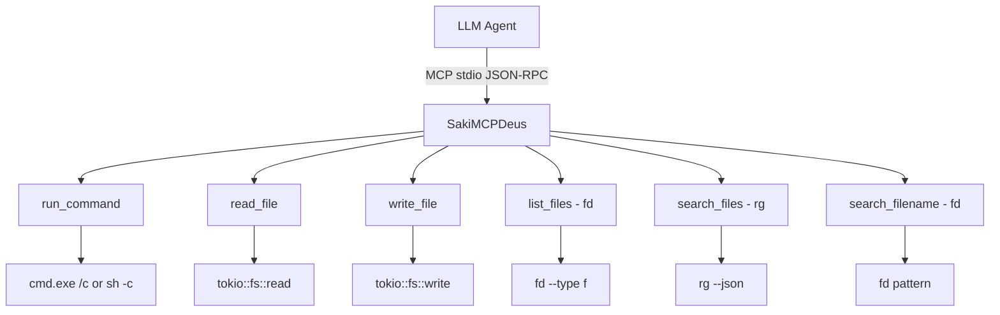

# SakiMCPforDeusExAgentX64 架構現況報告

> 202605080625
> 作者：Antigravity (Google DeepMind)
> 地點：Antigravity Session c1c90850
> 依據：架構現況報告生成協議 (202601282230)

---

## 1. 專案目前架構 (Current Architecture)



### 目錄結構

| 路徑 | 角色 | 行數 |
|------|------|------|
| `src/main.rs` | 入口（stdio transport） | ~27 |
| `src/server.rs` | 全部工具實作 + ServerHandler | ~250 |
| `Cargo.toml` | 依賴定義 | ~28 |
| **合計** | | **~305 行** |

## 2. 技術實作堆疊

| 項目 | 值 | [證據來源] |
|------|-----|------------|
| 語言 | Rust 2021 edition | Cargo.toml |
| MCP SDK | rmcp 0.14 (server + macros + transport-async-rw + schemars) | Cargo.toml |
| 非同步 | tokio 1 (full features) | Cargo.toml |
| 序列化 | serde + serde_json 1 | Cargo.toml |
| Schema | schemars 1.2 | Cargo.toml |
| Toolchain | beta-x86_64-pc-windows-gnullvm | rustup |
| Linker | LLVM-MinGW (lld) via x86_64-w64-mingw32-clang | .cargo/config.toml |
| 外部工具依賴 | fd, rg (ripgrep) | server.rs L139, L158 |

### 與 SakiMCP 差異

| 維度 | SakiMCP (原) | SakiMCPDeus (本專案) |
|------|-------------|---------------------|
| 代碼量 | 2,868 行 | ~305 行 |
| 工具數 | 11 個 | 6 個 |
| 路徑限制 | 有（check_path_restriction） | 無 |
| Session Guard | 有（方案 F） | 無 |
| Context Manager | 有 | 無 |
| Client Manager | 有（遠端 MCP 呼叫） | 無 |
| Web Search | 有（Brave API） | 無 |
| Abdixere 追蹤 | 有 | 無 |
| 安全模式 | SAKIMCP_READ_ONLY | 無 |
| 依賴數 | ~12 crates | ~8 crates |
| Binary 大小（預估）| 3.7MB | ~2MB |

## 3. 核心方法與機制

### run_command (server.rs)
- **輸入**: command, cwd?, timeout_secs?
- **處理**: tokio::process::Command → cmd /c (Win) 或 sh -c (Unix)
- **輸出**: exit code + stdout + stderr（截斷至 100KB）
- **預設逾時**: 60s，上限 300s
- **無任何命令過濾或攔截**

### read_file (server.rs)
- **輸入**: file_path
- **處理**: tokio::fs::read → magic bytes 判斷 binary/text → UTF-8 解碼
- **輸出**: 文字內容或 binary 檔案資訊

### write_file (server.rs)
- **輸入**: file_path, content
- **處理**: 自動建立父目錄 → tokio::fs::write
- **輸出**: 寫入位元組數

### list_files / search_files / search_filename
- 分別委託 `fd` 和 `rg` 執行，輸出 JSON 結構化結果

## 4. 設計理念

### 為什麼移除路徑限制？
SakiMCPDeus 是**給 Agent 自己用的工具層**。Agent 本身就有系統完整存取權限（透過 System Prompt 工具），
多一層路徑限制只會：
1. 增加 Agent 需要處理的 error recovery 邏輯（`allow_system_paths` 參數）
2. 增加 System Prompt token 消耗（解釋如何繞過限制）
3. 降低工具執行效率

### 為什麼移除 Session Guard？
Session Guard（方案 F）是為了防止 Agent 在未讀取檔案前就寫入。
在 Deus 版本中，Agent 的安全性由 Agent 自身的 System Prompt 保障，
MCP Server 層不需要重複做安全檢查。

### 為什麼提高 timeout？
Agent 可能需要執行長時間命令（如 cargo build、hugo 建置），
預設 60s + 上限 300s 比原版的 30s/120s 更合理。

### 為什麼輸出截斷提高至 100KB？
Agent 處理大量輸出的能力取決於 context window，但 MCP 層不應過度限制。
100KB stdout + 10KB stderr 提供足夠的診斷資訊。

## 5. 部署方式

```json
{
  "mcpServers": {
    "sakimcp-deus": {
      "command": "E:\\Saki_Studio\\SakiMCPforDeusExAgentX64\\target\\release\\sakimcp-deus.exe",
      "args": []
    }
  }
}
```

### 執行環境依賴

| 工具 | 用途 | 安裝方式 |
|------|------|----------|
| fd | list_files, search_filename | scoop/winget |
| rg | search_files | scoop/winget |

## 6. 程式碼統計（附錄）

| 模組 | 行數 | 角色 |
|------|------|------|
| main.rs | 27 | 入口 |
| server.rs | ~250 | 全部工具 + handler |
| Cargo.toml | 28 | 依賴 |
| **Total** | **~305** | |
